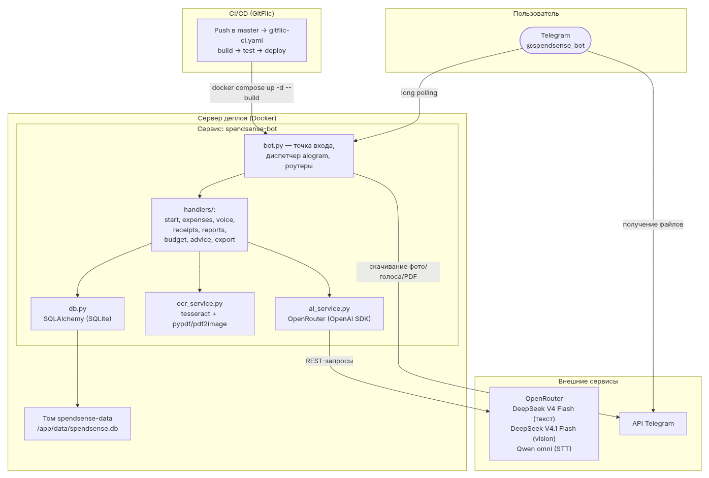

# SpendSense - AI-ассистент для управления личными финансами
Telegram-бот для учёта личных расходов: приём через текст, голос и фото чеков,
автоматическая категоризация трат через ИИ, отчёты по периодам и рекомендации по экономии.

## Возможности
- Добавление расходов текстом (`/add 250 кофе`)
- Голосовой ввод расходов (распознавание речи)
- Распознавание чеков: фото, документы и **PDF** (OCR + vision-запасной путь)
- AI-категоризация покупок (текст, голос, чеки)
- **Обучение на правках**: смена категории запоминается и применяется без вызова ИИ
- Отчёты за месяц с графиками + **PDF-отчёт**
- Настройка бюджета и контроль трат
- **Рекомендации по экономии** (`/advice`)
- **Экспорт данных** в CSV (`/export`) и **напрямую в Google Sheets** (`/export_sheets`)

## Технологии
Python · aiogram 3 · SQLAlchemy (SQLite/PostgreSQL) · **OpenRouter** (единый шлюз к AI-моделям) · **DeepSeek V4 Flash** (основная модель) · OCR

### AI-модели (OpenRouter)
| Задача | Модель |
|---|---|
| Категоризация, парсинг текста, рекомендации | `deepseek/deepseek-v4-flash` |
| Распознавание чеков: OCR + AI-парсинг (fallback - vision) | `deepseek/deepseek-v4.1-flash` |
| Голосовой ввод (распознавание речи) | `qwen/qwen3.8-omni-flash` |

Схема распознавания чеков: фотография → OCR (`pytesseract`) → текст → промпт `prompts/receipt.txt` (V4 Flash) → список покупок. Если качество распознанного текста низкое, используется запасной путь - прямая обработка изображения моделью с vision (`deepseek/deepseek-v4.1-flash`).

Названия моделей задаются в `.env` (`config.py`) - смена модели не требует правки кода.

## Деплой (GitFlic CI/CD)
GitFlic настроен на CI/CD. Деплой выполняет **GitFlic Runner** на сервере деплоя: `/var/run/docker.sock` смонтирован в задания, поэтому сборка и запуск контейнера идут напрямую через Docker (без SSH к серверу).

**Как это работает:** пуш в ветку `master` запускает пайплайн `gitflic-ci.yaml`:
1. `build` - сборка образа `spendsense:latest`;
2. `deploy` - генерация `.env` из секретов CI/CD и запуск `docker compose up -d --build`.

**Переменные CI/CD** (задаются в GitFlic → CI/CD → Переменные проекта):
| Переменная | Назначение |
|---|---|
| `BOT_TOKEN` | токен Telegram-бота |
| `OPENROUTER_API_KEY` | ключ OpenRouter (маскированная) |
| `AI_MODEL`, `AI_MODEL_OCR`, `AI_MODEL_STT` | опционально - переопределить модели |

Секреты попадают в контейнер через `.env`, который генерируется на стадии `deploy` (в репозитории не хранятся). Данные SQLite хранятся на постоянном томе `spendsense-data`.

⚠️ **Доступ к OpenRouter:** OpenRouter может блокировать запросы с NAT-IP серверов. Для работы AI-функций внешний IP сервера деплоя должен отличаться от блокируемого (например, через VPN/туннель). Проверка: `curl -s https://api.ipify.org`.

## Принципы разработки
Проект строится на принципах **SOLID, KISS и DRY** с соблюдением баланса: простота MVP в приоритете, абстракции вводятся только там, где реально нужны (смена модели/БД).

Все комментарии в коде, сноски, описания и README - **на русском языке**.

## Виртуальное окружение (.venv)
Проект использует виртуальное окружение `.venv` - оно уже создано в папке проекта и не попадает в git (см. `.gitignore`). Используй его при каждом запуске и установке зависимостей.

**Активация:**
```bash
# Linux / macOS
source .venv/bin/activate

# Windows (PowerShell)
.venv\Scripts\Activate.ps1

# Windows (CMD)
.venv\Scripts\activate.bat
```

После активации в начале строки терминала появляется `(.venv)` - окружение активно.

**Проверка версии Python в окружении:**
```bash
.venv/bin/python --version   # Linux / macOS
```

**Установка зависимостей** (при первичной настройке или после изменения `requirements.txt`):
```bash
pip install -r requirements.txt
```

**Деактивация окружения:**
```bash
deactivate
```

**Пересоздание окружения (если что-то сломалось):**
```bash
rm -rf .venv
python3 -m venv .venv
```

## Запуск
```bash
source .venv/bin/activate          # активировать окружение
pip install -r requirements.txt    # установить зависимости
cp .env.example .env               # подставить свои токены
python bot.py                      # запустить бота
```

Не забудь создать бота у [@BotFather](https://t.me/BotFather) и получить токен.

## Структура
```
SpendSense/
├── bot.py          # точка входа
├── config.py       # конфигурация (токены, модели, БД)
├── db.py           # работа с базой данных (в т.ч. правила "обучения")
├── ai_service.py   # обёртка над AI API (OpenRouter)
├── ocr_service.py  # локальный OCR (tesseract), PDF (pypdf/pdf2image)
├── sheets_service.py  # экспорт в Google Sheets (Service Account)
├── handlers/       # обработчики команд, голоса, чеков, отчётов и т.д.
├── prompts/        # папка с промптами
├── tests/          # юнит-тесты
├── docs/           # ТЗ, схема архитектуры, библиотека промптов, отчёт о тестировании
└── requirements.txt
```

## Библиотека промптов
Все использованные промпты собраны в [docs/prompts.md](docs/prompts.md).

## Экспорт в Google Sheets (`/export_sheets`)
Расходы за текущий месяц записываются в Google Sheets напрямую - через **Service Account** Google (бесплатно, без лимитов, актуальных для бота).

**Настройка (один раз):**
1. В Google Cloud Console → создай проект → включи **Google Sheets API**.
2. Создай **Service Account** → скачай его **JSON-ключ** (`credentials.json`).
3. Создай таблицу Google Sheets → "Настройки доступа" → добавь **email сервисного аккаунта** (роль "Редактор").
4. Задай переменные окружения (в `.env` локально или в переменных CI/CD GitFlic):
   - `GOOGLE_CREDENTIALS_JSON` - содержимое JSON-ключа одной строкой (или путь `GOOGLE_CREDENTIALS_PATH`);
   - `GOOGLE_SHEET_ID` - ID таблицы из URL (`docs.google.com/spreadsheets/d/<ID>/edit`);
   - `GOOGLE_SHEET_RANGE` - имя листа (по умолчанию `Sheet1`).

Заголовок создаётся при первом экспорте, дальше строки дописываются в конец листа.

## Документация
- [Техническое задание](docs/ТЗ.md)
- [Схема архитектуры приложения](docs/архитектура.md) ()
- [Отчёт о тестировании (KPI)](docs/тестирование.md)

---

Автор: Alex Che
Лицензия: MIT
