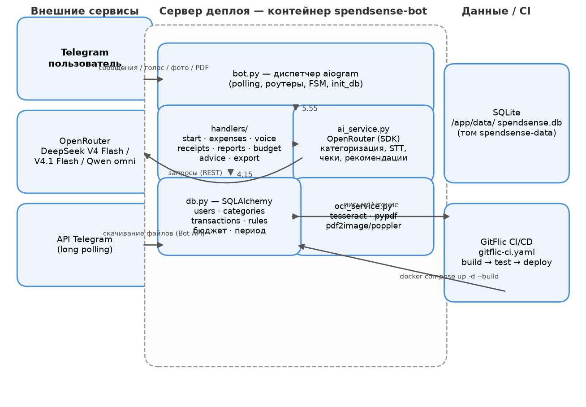

# 🏗 Схема архитектуры SpendSense

Требование варианта 1.md (Этап 1): «Нарисовать схему архитектуры приложения».



## Диаграмма (Mermaid)

```mermaid
flowchart TB
    subgraph Пользователь
        TG([Telegram\n@spendsense_bot])
    end

    subgraph "Сервер деплоя (Docker)"
        subgraph "Сервис: spendsense-bot"
            BOT["bot.py — точка входа,\nдиспетчер aiogram, роутеры"]
            H["handlers/:\nstart, expenses, voice,\nreceipts, reports,\nbudget, advice, export"]
            AI["ai_service.py\nOpenRouter (OpenAI SDK)"]
            OCRS["ocr_service.py\ntesseract + pypdf/pdf2image"]
            DB["db.py\nSQLAlchemy (SQLite)"]
            BOT --> H
            H --> AI
            H --> OCRS
            H --> DB
        end
        VOL[("Том spendsense-data\n/app/data/spendsense.db")]
        DB --> VOL
    end

    subgraph "Внешние сервисы"
        OR["OpenRouter\nDeepSeek V4 Flash (текст)\nDeepSeek V4.1 Flash (vision)\nQwen omni (STT)"]
        TGAPI["API Telegram"]
    end

    TG -->|long polling| BOT
    TG -->|получение файлов| TGAPI
    BOT -->|скачивание фото/голоса/PDF| TGAPI
    AI -->|REST| OR

    subgraph "CI/CD (GitFlic)"
        CFG["Push в master → gitflic-ci.yaml\nbuild → test → deploy"]
        CFG -->|docker compose up -d --build| BOT
    end
```

## Слои и их ответственность

| Слой | Модули | Ответственность |
|---|---|---|
| **Представление** | `handlers/*` | Приём команд/сообщений Telegram, диалоги подтверждения (FSM), ответы |
| **Сервисы** | `ai_service.py`, `ocr_service.py` | Вызовы OpenRouter (категоризация, STT, чеки, рекомендации), локальный OCR/PDF |
| **Хранение** | `db.py` | Модели SQLAlchemy: `users`, `categories`, `transactions`, `category_rules`, бюджет |
| **Конфигурация** | `config.py` | Токены, модели, URL, БД — из переменных окружения |

## Поток данных (ключевые сценарии)

1. **Текст** `/add 250 кофе`: `expenses.py` → `ai_service.categorize` (DeepSeek V4 Flash) → `db.add_transaction`; смена категории = «обучение» (правило в `category_rules`).
2. **Голос**: `voice.py` → ffmpeg (ogg→wav) → STT (Qwen omni) → категоризация → подтверждение кнопками → `db`.
3. **Чек (фото/PDF)**: `receipts.py` → tesseract (или текстовый слой PDF) → парсинг (V4 Flash) → подтверждение; слабый OCR → vision (V4.1 Flash).
4. **Отчёт**: `reports.py` → `db.month_summary` → PNG-график (matplotlib) + PDF-отчёт; рекомендации (V4 Flash).
5. **Экспорт**: `export.py` → CSV (совместим с Google Sheets/Excel).

## Решение БД

SQLite для MVP (файл на постоянном томе), переход на PostgreSQL — через переменную `DATABASE_URL` без изменения кода. Многопользовательность — изоляция по `user_id` (Telegram ID пользователя).